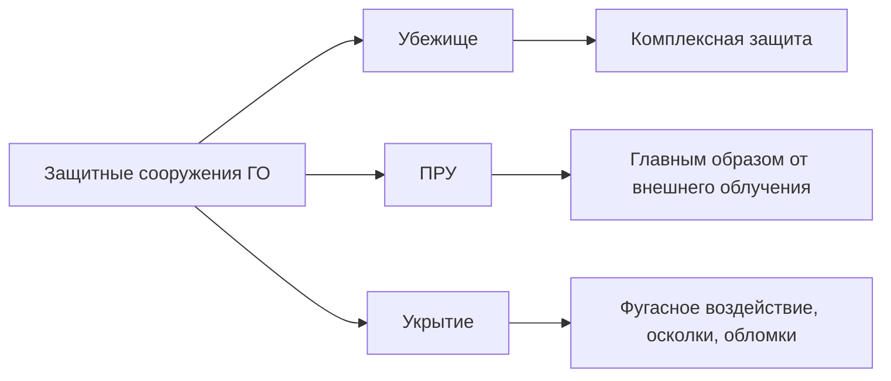
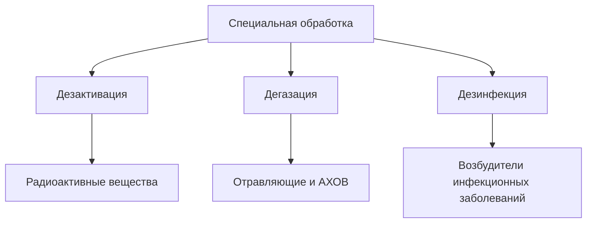
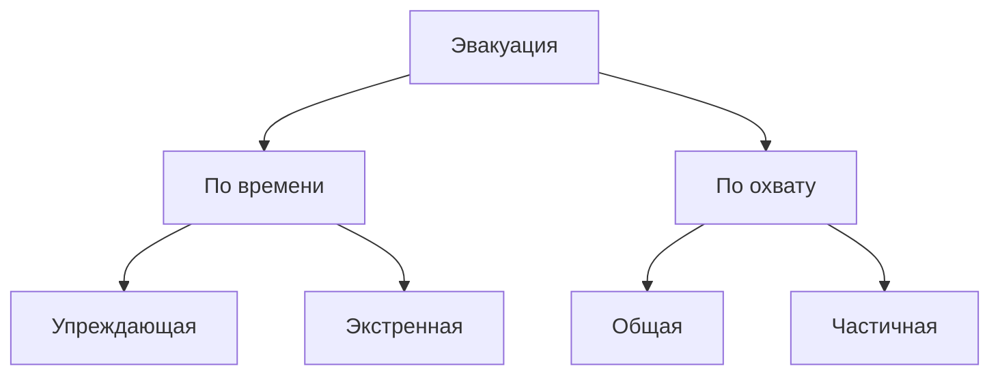
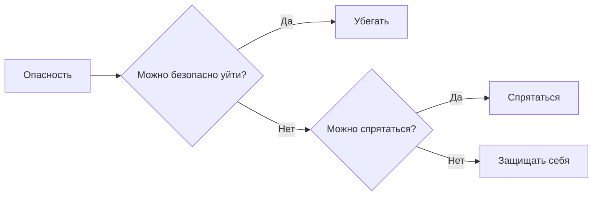

---
aliases:
  - "ОБЖ 06.10"
  - "Пожар, ГО, эвакуация, СИЗ, обморок и судороги"
tags:
  - university
  - obzh
  - bzhd
  - lecture-note
  - пожар
  - гражданская-оборона
  - эвакуация
  - сиз
  - первая-помощь
subject: "ОБЖ / БЖД"
type: "lecture-note"
date: 2026-10-06
status: restored
source: "Конспект_ОБЖ.txt"
---

# 06.10 — пожар, гражданская оборона, эвакуация, СИЗ, обморок и судороги

> [!info] Навигация
> [[00 - ОБЖ и БЖД|ОБЖ / БЖД]] · [[../summaries/2026-10-06_civil_defense_quick_review|Быстрое повторение]] · [[../exam/2026-10-06_civil_defense_LIKELY_TEST|Что может быть в тесте]] · [[../checks/There might be a mistake|Fact-check]]

> [!note] Источник
> Конспект добавлен **06.10.2026** из файла `Конспект_ОБЖ.txt`. В самом исходнике указано: **«По материалам двух лекций»**. Граница между этими двумя лекциями в файле не обозначена, поэтому материал сохранён единым конспектом без искусственного разделения.

---

# 1. Пожар в квартире и действия при пожаре

## Что делать сначала

При возникновении пожара главное — **как можно быстрее вызвать пожарную службу по номеру 101 или 112**.

При вызове сообщить:
- причину вызова;
- адрес;
- как лучше подъехать к дому.

Если рядом несколько человек, один вызывает пожарных, другой может пытаться тушить **небольшой** очаг возгорания.

## Что нельзя делать

- сначала долго тушить пожар и только потом вызывать пожарных;
- идти через сильно задымлённое помещение или подъезд без защиты органов дыхания;
- пользоваться лифтом;
- без крайней необходимости спускаться по водосточным трубам, верёвкам, простыням и т. п.;
- открывать окна и двери в горящем помещении — приток воздуха усиливает горение;
- выпрыгивать из окон без крайней необходимости;
- тушить водой электроприборы под напряжением;
- прятаться в шкафу, под кроватью, под диваном;
- смазывать ожоги маслом;
- паниковать.

## При задымлении

- дым поднимается вверх, поэтому более пригодный для дыхания воздух остаётся ближе к полу;
- передвигаться лучше **на корточках или на четвереньках**;
- желательно двигаться вдоль стены;
- в сильном дыму не идти в полный рост.

## Если подъезд задымлён и выйти нельзя

1. Закрыть дверь в квартиру.
2. Закрыть щели в двери тканью.
3. Вызвать пожарных.
4. Собрать документы и самое необходимое.
5. Одеться по сезону.
6. Находиться в безопасном месте квартиры и подавать сигналы о помощи.
7. Не пользоваться лифтом.

## Угарный газ

**CO** соединяется с гемоглобином крови и образует **карбоксигемоглобин**. Из-за этого нарушается перенос кислорода к тканям и головному мозгу, человек может потерять сознание.

## Подручные средства тушения небольшого очага

По лекции перечислены:
- вода;
- земля или песок;
- пищевая сода;
- стиральный порошок;
- крупа;
- металлическая крышка;
- плотная натуральная ткань или плед.

> [!important]
> Электропожар сначала обесточить. Водой нельзя тушить электроустановки под напряжением, горящее масло и нефтепродукты.

---

# 2. Действия при обстреле

## На улице

Если слышен свист боеприпаса или взрыв:
- немедленно лечь на землю;
- плотно закрыть уши;
- приоткрыть рот, чтобы уменьшить воздействие перепада давления.

В качестве укрытия по лекции могут использоваться:
- защитное сооружение;
- канава;
- бордюр;
- фундамент забора;
- другие углубления и прочные укрытия.

Не находиться рядом с:
- техникой;
- пожароопасными объектами;
- взрывоопасными объектами.

По лекции от многоэтажных панельных домов рекомендуется находиться на расстоянии **не менее 30–50 м** из-за опасности обрушения конструкций.

## Дома

- лучше спуститься в оборудованный подвал;
- желательно, чтобы подвал имел вентиляцию и два выхода;
- если подвала нет — спуститься на нижний этаж;
- если покинуть квартиру нельзя — укрыться в наиболее защищённом помещении;
- не находиться напротив окон.

## В общественном транспорте

1. Попросить водителя остановиться.
2. Выйти.
3. Отойти от дороги и зданий.
4. Лечь на землю.
5. Затем искать надёжное укрытие.

## В личном автомобиле

- остановиться;
- выйти из машины;
- лечь на землю **не рядом с автомобилем**;
- под машиной не прятаться.

---

# 3. Тревожный чемоданчик

**Тревожный чемоданчик** — заранее подготовленный набор вещей, необходимых для выживания и эвакуации при чрезвычайной ситуации.

Для семьи рекомендуется рюкзак достаточного объёма, который можно переносить самостоятельно.

## Что должно быть

- документы и копии важных документов;
- деньги и банковские карты;
- аптечка;
- постоянно принимаемые лекарства;
- фонарик и запасные батарейки;
- мобильный телефон и зарядное устройство;
- по возможности радиоприёмник;
- средства гигиены;
- сухие и влажные салфетки;
- мыло, зубная щётка, паста;
- спички или зажигалка;
- мусорные пакеты;
- блокнот и ручка;
- запас нижнего белья и носков;
- тёплая одежда по сезону;
- лёгкая посуда;
- вода;
- продукты длительного хранения.

Примеры продуктов по лекции:
- мясные и рыбные консервы;
- сухари;
- печенье;
- шоколад;
- продукты, которые можно есть без сложного приготовления.

> [!warning] Лекционная цифра
> В исходнике записано: **минимальный запас воды — около 2 литров на человека на трое суток**. Формулировка сохранена как материал лекции; внешняя проверка ведётся отдельно.

Тревожный чемоданчик особенно нужен при проживании:
- в районах возможных землетрясений;
- в районах наводнений;
- рядом с лесными массивами с риском крупных пожаров;
- рядом с опасными промышленными объектами;
- в районах возможных вооружённых конфликтов.

---

# 4. Защитные сооружения гражданской обороны

По лекции выделяются три вида:

1. **убежище**;
2. **противорадиационное укрытие (ПРУ)**;
3. **укрытие**.

> [!caption] Дополнительная схема
> Составлена только по классификации и назначениям, записанным в конспекте.

## Убежище

Предназначено для защиты людей от:
- поражающих факторов ядерного оружия;
- химического оружия;
- обычных средств поражения;
- бактериальных средств;
- аварийно-химически опасных веществ;
- высоких температур;
- продуктов горения при пожарах.

### Цифры из лекции

- избыточное давление — **1 кгс/см²**;
- ослабление проникающей радиации — **в 1000 раз**;
- время пребывания — **48 часов / 2 суток**;
- на объектах атомной энергетики — **до 5 суток**;
- площадь — **не менее 0,5 м² на человека**.

Убежище должно иметь:
- герметическую защитную дверь;
- тамбур;
- фильтровентиляционную установку;
- помещение для людей;
- санитарно-бытовые помещения;
- медицинскую комнату;
- дополнительный аварийный выход.

## Противорадиационное укрытие — ПРУ

Предназначено главным образом для защиты от внешнего облучения при радиоактивном загрязнении местности.

По лекции:
- время пребывания — **2 суток**;
- на объектах атомной энергетики — **до 5 суток**;
- в зоне слабых разрушений расчётное давление — **0,2 кгс/см²**;
- современные ПРУ должны ослаблять радиацию минимум **в 500 раз**.

## Укрытие

Защищает от:
- фугасного воздействия;
- осколков;
- обломков строительных конструкций;
- обрушения вышележащих конструкций.

Может располагаться:
- в подвалах;
- в цокольных этажах;
- на первых этажах;
- в подземных пространствах;
- в метрополитене;
- в других приспособленных подземных сооружениях.

Время защитного функционирования по лекции — **12 часов**.

## Классификация защитных сооружений

По лекции классифицируются:
- по назначению;
- по месту расположения;
- по срокам строительства;
- по вместимости.

По месту расположения:
- встроенные;
- отдельно стоящие.

По срокам строительства:
- построенные заблаговременно;
- быстровозводимые.

В конспекте также записано: в любом защитном сооружении должно быть два выхода, один из которых используется как аварийный.

## Правила поведения в убежище

- не курить;
- не шуметь;
- не пользоваться открытым огнём без разрешения;
- не приносить легковоспламеняющиеся и сильно пахнущие вещества;
- не брать громоздкие вещи;
- не ходить по помещениям без необходимости;
- выходить только после разрешения ответственного лица.

---

# 5. Специальная обработка

Специальная обработка проводится для устранения опасного загрязнения людей, предметов, техники, помещений и территории.

- **Дезактивация** — удаление радиоактивных веществ с заражённых объектов.
- **Дегазация** — уничтожение, нейтрализация или удаление отравляющих и аварийно-химически опасных веществ.
- **Дезинфекция** — уничтожение возбудителей инфекционных заболеваний.

## Санитарная обработка людей

Бывает:
- частичная;
- полная.

**Частичная:** в основном обрабатываются открытые участки тела.

**Полная:**
- полное мытьё тела;
- смена загрязнённой одежды;
- контроль после обработки;
- выдача чистой одежды.

---

# 6. Средства индивидуальной защиты

**СИЗ** — средства индивидуального пользования для уменьшения или предотвращения воздействия опасных факторов и загрязнений.

Основные группы:
1. средства индивидуальной защиты органов дыхания — **СИЗОД**;
2. средства защиты кожи;
3. медицинские средства индивидуальной защиты.

## СИЗ органов дыхания

- гражданские противогазы;
- респираторы;
- фильтрующие самоспасатели.

По лекции противогаз защищает:
- органы дыхания;
- глаза;
- кожу лица;
- от ряда отравляющих, радиоактивных и биологических веществ.

В лекции отдельно записано: **обычный гражданский противогаз не защищает от дыма и угарного газа**.

Респираторы применяются прежде всего для защиты от различной пыли, в том числе радиоактивной.

Фильтрующие самоспасатели могут использоваться при эвакуации во время пожара.

## Средства защиты кожи

- защитные костюмы;
- лёгкие защитные костюмы;
- ОЗК;
- непромокаемые плащи и куртки;
- резиновые перчатки;
- резиновые сапоги.

---

# 7. Эвакуация населения

**Эвакуация** — комплекс мероприятий по организованному перемещению населения, материальных и культурных ценностей, документов из опасной зоны в безопасный район.

**Рассредоточение** — организованный вывоз работников предприятий, которые продолжают работу, в загородную зону на время отдыха между рабочими сменами.

## Виды эвакуации

- упреждающая;
- экстренная;
- общая;
- частичная.

- **Упреждающая** — при высокой вероятности аварии или стихийного бедствия.
- **Экстренная** — уже при возникновении ЧС, когда времени мало.
- **Общая** — выводятся все категории населения.
- **Частичная** — в первую очередь дети и нетрудоспособное население.

Основной способ эвакуации — **комбинированный**:
- часть населения выводится пешком;
- часть вывозится транспортом.

Транспорт в первую очередь используется для:
- детей;
- больных;
- женщин с маленькими детьми;
- пожилых людей.

## СЭП

**СЭП — сборный эвакуационный пункт.**

Задачи СЭП:
- сбор населения;
- регистрация;
- подготовка к отправке;
- формирование пеших колонн;
- посадка людей на транспорт;
- оказание медицинской помощи;
- санитарно-гигиенические мероприятия.

После сигнала об эвакуации:
1. быстро подготовиться;
2. взять тревожный чемоданчик;
3. взять документы;
4. прибыть на СЭП в указанное время;
5. пройти регистрацию;
6. выполнять указания ответственных лиц.

---

# 8. Действия при вооружённом нападении

Главный принцип по лекции:

## В классе или помещении

- закрыть дверь на ключ;
- если ключа нет — забаррикадировать дверь мебелью;
- отойти подальше от двери и окон;
- выключить свет;
- отключить источники шума;
- телефон перевести на беззвучный режим;
- отключить вибрацию;
- при возможности сообщить по номеру 112;
- соблюдать тишину;
- выполнять указания преподавателя, администрации и спасателей.

Если слышна стрельба:
- не паниковать;
- определить направление опасности;
- не выходить навстречу нападающему;
- при безопасной возможности покинуть опасную зону;
- при невозможности ухода — спрятаться и ждать помощи.

---

# 9. Подозрительный предмет

Если обнаружен неизвестный или подозрительный предмет:
- не трогать;
- не перемещать;
- не вскрывать;
- не пользоваться рядом открытым огнём;
- сообщить сотрудникам полиции или другим ответственным службам;
- не подпускать других людей;
- выполнять команды специалистов.

По материалам лекции безопасное расстояние от подозрительного предмета должно быть **не менее 100 м**.

---

# 10. Обморок

**Обморок** — внезапная кратковременная потеря сознания, связанная с временным недостаточным кровоснабжением головного мозга.

## Возможные причины

- душное помещение;
- стресс;
- переутомление;
- страх;
- боль;
- резкий переход из горизонтального положения в вертикальное.

## Признаки предобморочного состояния

- слабость;
- головокружение;
- холодный пот;
- бледность;
- «мушки» перед глазами;
- тошнота.

## Первая помощь по лекции

- уложить человека на спину;
- приподнять ноги или подложить под них валик;
- не позволять резко вставать;
- обеспечить покой.

Если человек чувствует, что сейчас потеряет сознание:
- не вставать;
- сесть;
- опустить голову вниз или положить её на стол/колени.

По лекции: если обморок продолжается **более 5 минут** и состояние не улучшается — вызвать скорую помощь.

---

# 11. Эпилептический приступ

Во время приступа человек может:
- потерять сознание;
- испытывать судороги;
- иметь повышенное слюноотделение;
- временно иметь нарушение дыхания.

Приступ может состоять из:
- **тонической фазы**;
- **клонической фазы**.

**Абсанс** — кратковременное «замирание» человека, обычно на несколько секунд.

## Первая помощь при судорогах по лекции

- обязательно засечь время начала приступа;
- убрать предметы, о которые человек может удариться;
- по возможности уложить человека в устойчивое боковое положение;
- расстегнуть тесную одежду;
- защитить голову от травмы;
- оставаться рядом до окончания приступа.

## Нельзя

- силой удерживать руки и ноги;
- останавливать судороги;
- разжимать челюсти;
- класть в рот ложку, пальцы или другие предметы;
- давать лекарства во время приступа;
- тормошить;
- кричать;
- обливать водой;
- оставлять человека одного.

## Когда по лекции вызывать скорую

- приступ произошёл впервые;
- приступ начался в воде;
- пострадавший — ребёнок, пожилой человек или беременная женщина;
- человек долго не приходит в сознание;
- есть серьёзная травма;
- приступы повторяются один за другим.

---

# 12. Что обязательно выучить к тесту

## Телефоны

- **101** — пожарная служба;
- **112** — единый номер экстренных служб.

## Защитные сооружения

**Убежище — ПРУ — укрытие.**

Убежище по лекции:
- 1 кгс/см²;
- радиация ослабляется в 1000 раз;
- 48 часов;
- на объектах атомной энергетики — 5 суток;
- 0,5 м² на человека.

ПРУ:
- 2 суток;
- на объектах атомной энергетики — до 5 суток;
- современные ПРУ — ослабление радиации минимум в 500 раз.

Укрытие:
- защита в течение 12 часов.

## Спецобработка

- **дезактивация** → радиоактивные вещества;
- **дегазация** → химически опасные вещества;
- **дезинфекция** → болезнетворные микроорганизмы.

## Эвакуация

- упреждающая и экстренная;
- общая и частичная;
- основной способ — комбинированный;
- **СЭП** = сборный эвакуационный пункт.

## Пожар

- сначала вызвать **101/112**;
- лифтом не пользоваться;
- в дыму двигаться как можно ниже;
- электроприборы под напряжением водой не тушить.

## Судороги

- засечь время;
- убрать опасные предметы;
- защитить голову;
- ничего не класть в рот;
- не удерживать человека силой.

---

## Связанные заметки

- [[00 - ОБЖ и БЖД]]
- [[../summaries/2026-10-06_civil_defense_quick_review]]
- [[../exam/2026-10-06_civil_defense_LIKELY_TEST]]
- [[../checks/There might be a mistake]]
